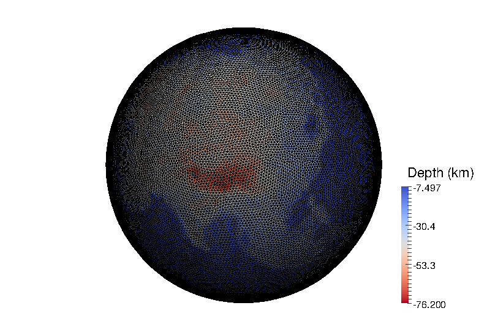

Planetary Model Builder 
================================================================
This repository provides codes to build a planet model on a tetrahedal mesh,
as well as its reference gravity. 

How to make it work for you? 
----------------------------------------------------------------
This repository uses several packages:  
+ TetGen by Hang Si  
+ distmesh by Per-Olof Persson  
+ several MATLAB scripts from Hesthaven & Warburton's book 'Nodal Discontinuous Galerkin Methods'  
+ fmmlib3d from Leslie Greengard and Zydrunas Gimbutas  
+ a MATLAB script for vtk users by Shawn Walker

I put most of the original materials under different folders 
with some minor changes for this application.

You may follow the README.md under packages to compile what you need. 
If you only need to build a tetrahedal mesh, please compile tetgen; if you are a linux user, just go to packages/tetgen1.5.0 and type make. If you need to compute the reference gravity, please go to packages/fmmlib3d-1.2, and compile it.  

Build your planetary models
-----------------------------------------------------------------

What can you get?  
-----------------------------------------------------------------

Contact 
-----------------------------------------------------------------
