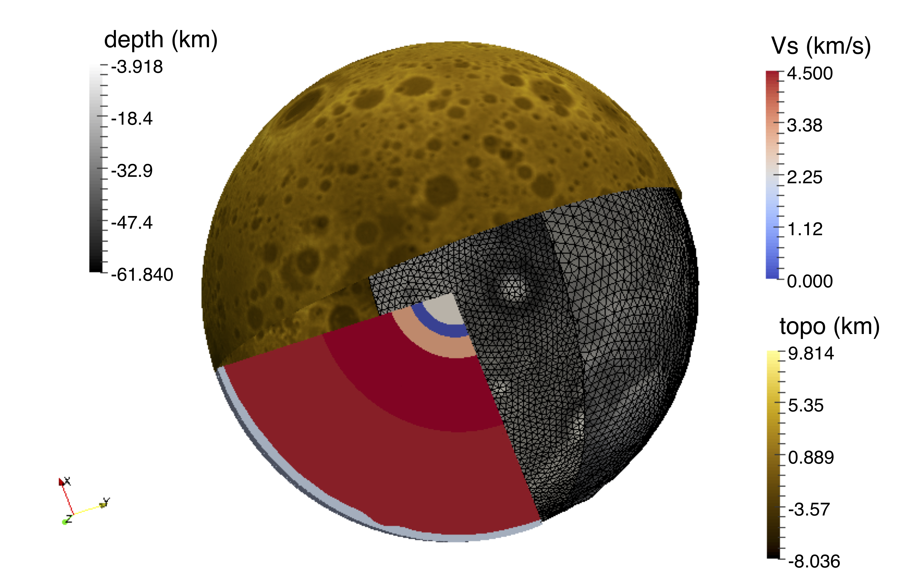
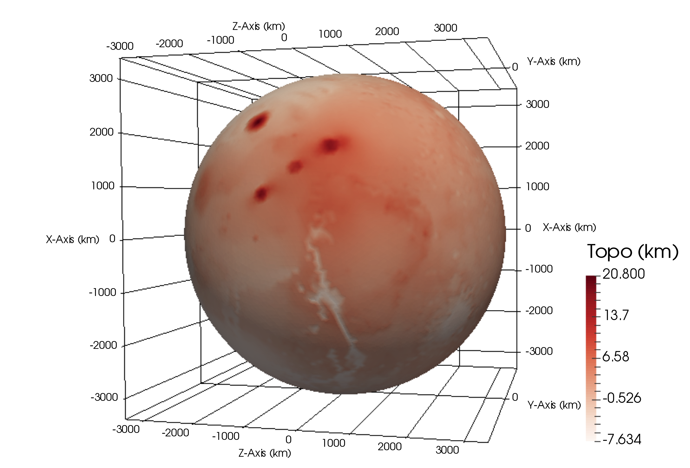
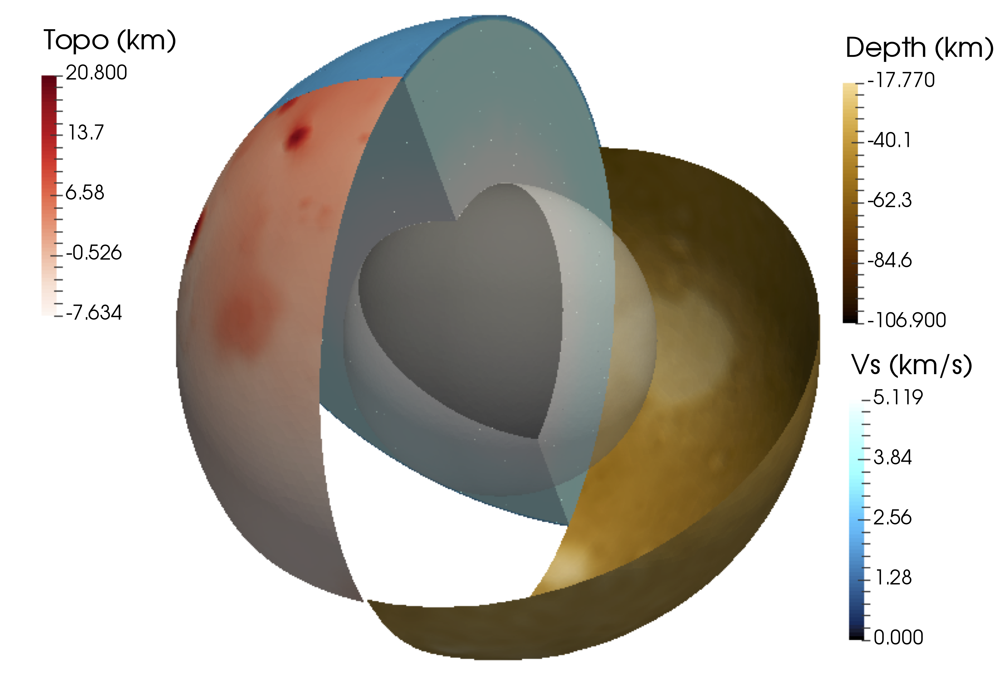

Planetary Model Builder 
================================================================
   

This repository provides scripts to build a planetary model on a deformable tetrahedal mesh
as well as its reference gravity. It supports and provides input files for the repository of [normal mode computation at planetary scales](https://github.com/js1019/NormalModes).  

    

In the above figures, examples of compressional and shear wave speed models of our Earth are illustrated. 

Contents
----------------------------------------------------------------
+ **Demos**: scripts to build 3D planetary models; 
+ **bin**: a script to run the Matlab scripts in the Demos/; 
+ **figs**: figures and animation of different planetary models; 
+ **modelbuilder**: scripts to build finite-element matrices and other information;
+ **packages**: external packages to build the mesh, compute the reference gravity and visualize the modeling results; 
+ **radialmodels**: scripts and data that contain information about radial planetary models from the existing literature; 
+ **discontinuities**: scripts to build discontinuities using unstructured triangles as well as some precomputed meshes; 
+ **visual**: scripts to visualize the normal modes computed from [normal mode computation at planetary scales](https://github.com/js1019/NormalModes).

How to make it work for you? 
----------------------------------------------------------------
This repository uses several packages, including 
+ [TetGen](http://www.tetgen.org) by Hang Si;   
+ [distmesh](http://persson.berkeley.edu/distmesh/) by Per-Olof Persson;  
+ [several Matlab scripts](https://github.com/tcew/nodal-dg) from Hesthaven & Warburton's book 'Nodal Discontinuous Galerkin Methods'; 
+ [fmmlib3d](https://github.com/zgimbutas/fmmlib3d) from Leslie Greengard and Zydrunas Gimbutas;  
+ [a Matlab script](https://www.mathworks.com/matlabcentral/fileexchange/58002-write-binary-vtk-file-for-tetrahedral-grid-with-scalar-and-vector-data?s_tid=prof_contriblnk) for vtk users by Shawn Walker; 

We've put most of the original codes under different folders 
with some minor changes for this application.

You may follow the README.md under packages to compile what you need. 
If you only need to build a tetrahedral mesh, please compile TetGen; if you are a Linux user, just go to packages/tetgen1.5.0 and type make. If you need to compute the reference gravity, please check the readme under packages/ and compile packages/fmmlib3d-1.2.  

Build your planetary models
-----------------------------------------------------------------
Please check the scripts under Demos/CONST for a constant ball model, Demos/PREM 
for a standard Earth model, Demos/Moon for a Moon model and Demos/RT_MarsDWAK for a Mars model. 
Under these folders, you may run 
~~~ 
run {CONST/PREM/M6Ltopo/MarsDWAK}_mesh; run Gravity;
~~~
to obtain the model and its reference gravity. 
Note that the 3D crusts used in this work are based on the results of several NASA missions, including 
the Lunar Orbiter Laser Altimeter ([LOLA](https://lola.gsfc.nasa.gov/)), Gravity Recovery and Interior Laboratory ([GRAIL](https://www.nasa.gov/mission_pages/grail/main/index.html)) and 
the Mars Orbiter Laser Altimeter ([MOLA](https://attic.gsfc.nasa.gov/mola/)). 
Please see discontinuities/ for more details. 

### Illustration of other terrestrial planets
 
Here, we show a Moon shear wave speed model in the top right figure, the Mars topography in the top middle figure and a Mars shear wave speed model in the top right figure. These models can be reproduced by the scripts provided in the Demos. 

### A few remarks
+ If the reference gravity is **NOT** needed, you do **NOT** have to run Gravity.
+ Here are two animations for [compressional wave speed of PREM](https://www.youtube.com/watch?v=4AeXhXGClcY) and [shear wave speed of PREM](https://www.youtube.com/watch?v=22yVo2G2e0k). 
+ We use [ParaView](https://www.paraview.org/) to visualize the results (**vtk or vtu files**). 
+ To design your own models, you may change the settings, including **different discontinuities and model profiles**. 
+ To insert discontinuities, such as topography, interior boundaries, please check the folder discontinuities/ and utilize **surface distance functions** to build your own meshes.  

Postprocess
------------------------------------------------------------------
You can use scripts in **visual/** to visualize your computed normal modes from [normal mode computation at planetary scales](https://github.com/js1019/NormalModes). 
Please check visual/README.md for more details. 

Furthermore
------------------------------------------------------------------
You can build more realistic models using similiar ideas and following the above tips! You may need to understand what distmesh can do. It is quite simple, please see [its Demos](http://persson.berkeley.edu/distmesh/).  

 

The top right figure illustrates an Earth compressional wave speed model based on [MIT tomographic results](https://pubs.geoscienceworld.org/ssa/srl/article/79/3/384/367688/upper-mantle-heterogeneity-beneath-north-america) (Burdick et al. 2017) 
and [crust 1.0](https://igppweb.ucsd.edu/~gabi/crust1.html) (Laske et al. 2013). The top left one shows the topography of the Moho discontinuity under Tibetan Plateau.
If you would like to reproduce these models, you may need to download the model data and make minor changes in the scripts to obtain and visualize your results. 

Reference
-------------------------------------------------------------------
The repository provides scripts to generate planetary models for [our SuperComputing (SC'18) paper](https://dl.acm.org/citation.cfm?id=3291751), see below for details. 
~~~
@inproceedings{shi2018computing,
  title={Computing planetary interior normal modes with a highly parallel polynomial filtering eigensolver},
  author={Shi, Jia and Li, Ruipeng and Xi, Yuanzhe and Saad, Yousef and de Hoop, Maarten V},
  booktitle={Proceedings of the International Conference for High Performance Computing, Networking, Storage, and Analysis, {SC}'18, Dallas, TX, November 11-16, 2018},
  pages={71:1--71:13},
  year={2018},
  organization={ACM/IEEE}
}
~~~

We also present the theory, discretization, and validation of our work in [this paper](https://arxiv.org/abs/1906.11082) on arXiv. 
~~~
@article{shi2019normalmodes,
  title{A Rayleigh-Ritz method based approach to computing seismic normal modes in the presence of an essential spectrum},
  author={Shi, Jia and Li, Ruipeng and Xi, Yuanzhe and Saad, Yousef and de Hoop, Maarten V},
  journal={arXiv preprint arXiv:1906.11082},
  year={2019}
}
~~~

Other related references can be found in modelbuilder/, packages/, radialmodels/ and  discontinuities/. 

Report
-----------------------------------------------------------------
Please let us know any issues of this repository. Contributions are welcome. 
